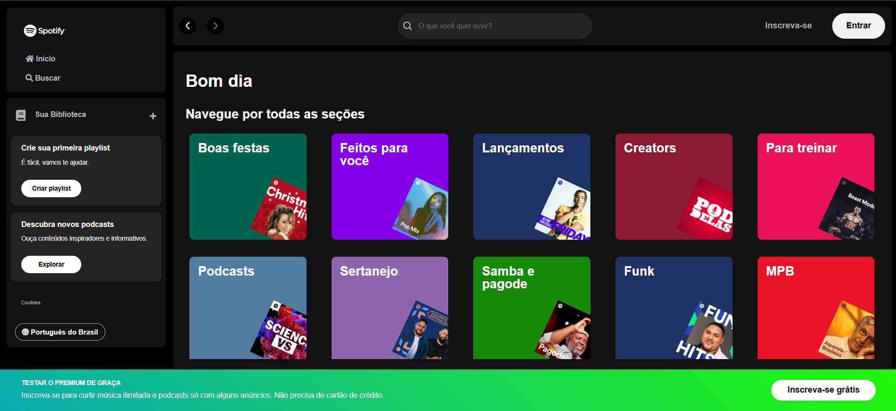

# Spotify Homepage 🎧🟩

Este projeto foi desenvolvido durante a **2ª edição da imersão Front-End da [Alura](https://www.alura.com.br/?srsltid=AfmBOorFKMXxXyiaLOD7mY6jsLzXksRHcAAA5TN4ismZd7wdULvTT3U5)** e simula a **homepage do Spotify**, proporcionando uma interface semelhante à plataforma de streaming de música.

<div align="center">
  
</div>

## Tecnologias Utilizadas

- **HTML:** Estrutura a página e layout.
- **CSS:** Estiliza da aplicação.
- **Font Awesome:** Serve ícones para os botões e navegação.
- **JavaScript:** Implementa funcionalidades interativas, como a busca de artistas.
- **JSON Server:** Atua como uma API mocada para simular o banco de dados de artistas.

## Como Rodar o Projeto

1. **Clone o repositório:**

```bash
git clone https://github.com/JosielJrr/spotify-homepage.git
```

2. **Entre no diretório do projeto:**

```bash
cd spotify-homepage
```

3. **Instale as dependências:**

```bash
npm install
```

4. **Inicie o servidor:**

```bash
npm run start:server
```

5. **Acesse o projeto:**
- Após rodar o servidor, abra o arquivo `index.html` diretamente no seu navegador para visualizar a aplicação.
